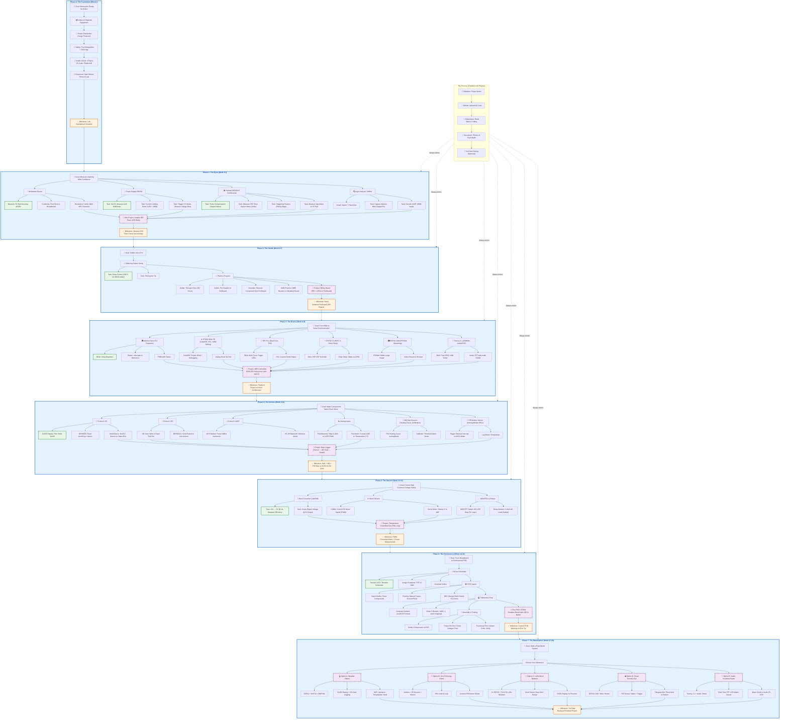

```mermaid
graph TB
    %% ==========================================
    %% STYLING
    %% ==========================================
    classDef phase fill:#e3f2fd,stroke:#1565c0,stroke-width:3px,color:#0d47a1,font-weight:bold
    classDef milestone fill:#fff3e0,stroke:#e65100,stroke-width:2px
    classDef skill fill:#e8f5e9,stroke:#2e7d32,stroke-width:2px
    classDef project fill:#f3e5f5,stroke:#6a1b9a,stroke-width:3px,stroke-dasharray:5 5

    %% ==========================================
    %% PHASE 0: WORKSPACE SETUP (UNCHANGED)
    %% ==========================================
    subgraph P0[" Phase 0: The Foundation (Week 1) "]
        direction TB
        P0_Goal["🎯 Goal: Workspace Ready for Action"]
        P0_1["📦 Unbox & Organize Equipment"]
        P0_2["🔌 Power Distribution (Surge Protector)"]
        P0_3["🧯 Safety: Fire Extinguisher + ESD Mat"]
        P0_4["💾 Install: KiCad, LTSpice, VS Code, PlatformIO"]
        P0_5["📸 Document: Take 'Before' Photo of Lab"]
        P0_Milestone["✅ Milestone: Lab Operational Checklist"]
        P0_Goal --> P0_1 --> P0_2 --> P0_3 --> P0_4 --> P0_5 --> P0_Milestone
    end

    %% ==========================================
    %% PHASE 1: MEASUREMENT MASTERY (UNCHANGED)
    %% ==========================================
    subgraph P1[" Phase 1: The Eyes (Week 2-3) "]
        direction TB
        P1_Goal["🎯 Goal: Measure Anything With Confidence"]
        %% Multimeter
        P1_M["📏 Multimeter Basics"]
        P1_M --> P1_M1["Measure: 5V Rail Accuracy ±0.05V"]
        P1_M --> P1_M2["Continuity: Find Short in Breadboard"]
        P1_M --> P1_M3["Resistance: Verify 10kΩ ±5% Tolerance"]
        %% Power Supply
        P1_PS["⚡ Power Supply 30V/5A"]
        P1_PS --> P1_PS1["Task: Set 5V, Measure with Multimeter"]
        P1_PS --> P1_PS2["Task: Current Limiting Demo (LED + 100Ω)"]
        P1_PS --> P1_PS3["Task: Trigger CC Mode, Observe Voltage Drop"]
        %% Oscilloscope
        P1_Scope["📊 Hantek DSO2D15 Oscilloscope"]
        P1_Scope --> P1_S1["Task: Probe Compensation (Square Wave)"]
        P1_Scope --> P1_S2["Task: Measure 555 Timer Square Wave (1kHz)"]
        P1_Scope --> P1_S3["Task: Triggering Practice (Rising Edge)"]
        P1_Scope --> P1_S4["Task: Measure Vpp Noise on 5V Rail"]
        %% Logic Analyzer
        P1_LA["🔍 Logic Analyzer 24MHz"]
        P1_LA --> P1_LA1["Install: Sigrok + PulseView"]
        P1_LA --> P1_LA2["Task: Capture Arduino Blink (Digital Pin)"]
        P1_LA --> P1_LA3["Task: Decode UART (9600 baud)"]
        P1_Milestone["✅ Milestone: Measure 555 Timer Circuit Successfully"]
        P1_Project["🔨 Mini-Project: Astable 555 Timer (LED Blink)"]
        P1_Goal --> P1_M & P1_PS & P1_Scope & P1_LA
        P1_M3 & P1_PS3 & P1_S4 & P1_LA3 --> P1_Project --> P1_Milestone
    end

    %% ==========================================
    %% PHASE 2: SOLDERING & ASSEMBLY (UNCHANGED)
    %% ==========================================
    subgraph P2[" Phase 2: The Hands (Week 4-5) "]
        direction TB
        P2_Goal["🎯 Goal: Solder Like a Pro"]
        P2_1["🔥 Soldering Station Setup"]
        P2_1 --> P2_T1["Task: Temp Control (350°C for 60/40 solder)"]
        P2_1 --> P2_T2["Task: Tinning the Tip"]
        P2_2["🧪 Practice Projects"]
        P2_2 --> P2_P1["Solder: Through-Hole LED Circuit"]
        P2_2 --> P2_P2["Solder: Pin Headers to Perfboard"]
        P2_2 --> P2_P3["Desolder: Remove Component from Perfboard"]
        P2_2 --> P2_P4["SMD Practice: 0805 Resistor on Breakout Board"]
        P2_Milestone["✅ Milestone: Hand-Soldered Perfboard LED Flasher"]
        P2_Project["🔨 Project: Blinky Board (555 + LEDs on Perfboard)"]
        P2_Goal --> P2_1 --> P2_2 --> P2_Project --> P2_Milestone
    end

    %% ==========================================
    %% PHASE 3: MICROCONTROLLERS 101 (UPDATED)
    %% ==========================================
    subgraph P3[" Phase 3: The Brains (Week 6-8) "]
        direction TB
        P3_Goal["🎯 Goal: From Blink to Serial Communication"]
        %% Arduino Nano
        P3_Nano["🟩 Arduino Nano (5V, Registers)"]
        P3_Nano --> P3_N1["Blink: Using Registers"]
        P3_Nano --> P3_N2["Button: Interrupts & Debounce"]
        P3_Nano --> P3_N3["PWM with Timers"]
        %% STM32
        P3_STM["⚙️ STM32 Blue Pill (CubeIDE, HAL, SWD Debug)"]
        P3_STM --> P3_STM1["CubeIDE Project: Blink + Debugging"]
        P3_STM --> P3_STM2["Analog Read via HAL"]
        %% RPi Pico
        P3_Pico["🍓 RPi Pico (Dual Core, PIO)"]
        P3_Pico --> P3_P1["Blink: Both Cores Toggle LEDs"]
        P3_Pico --> P3_P2["PIO: Custom Serial Output"]
        %% ESP32-C3
        P3_C3["⚡ ESP32-C3 (RISC-V, Deep Sleep)"]
        P3_C3 --> P3_C1["Blink: ESP-IDF Toolchain"]
        P3_C3 --> P3_C2["Deep Sleep: Wake on GPIO"]
        %% ESP32-CAM
        P3_CAM["📷 ESP32-CAM (PSRAM, Streaming)"]
        P3_CAM --> P3_CAM1["PSRAM: Buffer Large Image"]
        P3_CAM --> P3_CAM2["Video Stream to Browser"]
        %% Teensy 4.1
        P3_Teensy["🎹 Teensy 4.1 (600MHz, Audio/DSP)"]
        P3_Teensy --> P3_T1["Blink: Fast GPIO, USB Serial"]
        P3_Teensy --> P3_T2["Audio: FFT with Audio Shield"]

        P3_Milestone["✅ Milestone: Platform Project on Each Architecture"]
        P3_Project["🔨 Project: WiFi-Controlled RGB LED Strip (cross-arch option)"]

        P3_Goal --> P3_Nano & P3_STM & P3_Pico & P3_C3 & P3_CAM & P3_Teensy
        P3_N3 & P3_STM2 & P3_P2 & P3_C2 & P3_CAM2 & P3_T2 --> P3_Project --> P3_Milestone
    end

    %% ==========================================
    %% PHASE 4: PROTOCOLS & SENSORS (UPDATED)
    %% ==========================================
    subgraph P4[" Phase 4: The Senses (Week 9-11) "]
        direction TB
        P4_Goal["🎯 Goal: Make Components Talk to Each Other"]
        %% I2C
        P4_I2C["🔗 Protocol: I2C"]
        P4_I2C --> P4_I1["OLED Display: Print 'Hello World'"]
        P4_I2C --> P4_I2["MPU6050: Read Accel/Gyro Values"]
        P4_I2C --> P4_I3["Multi-Device: OLED + Sensor on Same Bus"]
        %% SPI
        P4_SPI["⚡ Protocol: SPI"]
        P4_SPI --> P4_SP1["SD Card: Write & Read Text File"]
        P4_SPI --> P4_SP2["NRF24L01: Send Packet to 2nd Arduino"]
        %% UART
        P4_UART["📞 Protocol: UART"]
        P4_UART --> P4_UR1["GPS Module: Parse NMEA Sentences"]
        P4_UART --> P4_UR2["HC-05 Bluetooth: Wireless Serial"]
        %% Analog
        P4_ADC["📈 Analog Inputs"]
        P4_ADC --> P4_A1["Potentiometer: Map 0-1023 to 0-255 PWM"]
        P4_ADC --> P4_A2["Thermistor: Convert ADC to Temperature (°C)"]
        %% EXTRAS: Gas and PIR Sensors
        P4_MQ["🛑 MQ Gas Sensors (Heating Curve, Calibration)"]
        P4_MQ --> P4_MQ1["Plot Heating Curve: AnalogRead"]
        P4_MQ --> P4_MQ2["Calibrate: Threshold Alarm Demo"]
        P4_PIR["🚶 PIR Motion Sensor (Interrupt/Wake MCU)"]
        P4_PIR --> P4_PIR1["Trigger External Interrupt on MCU Wake"]
        P4_PIR --> P4_PIR2["Log Motion Timestamps"]

        P4_Milestone["✅ Milestone: IMU + MQ + PIR Data on OLED & SD Card"]
        P4_Project["🔨 Project: Data Logger (Sensor → SD Card → Graph)"]

        P4_Goal --> P4_I2C & P4_SPI & P4_UART & P4_ADC & P4_MQ & P4_PIR
        P4_I3 & P4_SP1 & P4_A2 & P4_PIR2 --> P4_Project --> P4_Milestone
    end

    %% ==========================================
    %% PHASE 5: POWER ELECTRONICS (UNCHANGED)
    %% ==========================================
    subgraph P5[" Phase 5: The Muscle (Week 12-13) "]
        direction TB
        P5_Goal["🎯 Goal: Control High Current & Voltage Safely"]
        P5_1["🔋 Buck Converter (LM2596)"]
        P5_1 --> P5_B1["Task: 12V → 5V @ 1A, Measure Efficiency"]
        P5_1 --> P5_B2["Task: Scope Ripple Voltage @ 5V Output"]
        P5_2["⚙️ Motor Drivers"]
        P5_2 --> P5_M1["L298N: Control DC Motor Speed (PWM)"]
        P5_2 --> P5_M2["Servo Motor: Sweep 0° to 180°"]
        P5_3["💡 MOSFETs & Relays"]
        P5_3 --> P5_MOS1["MOSFET: Switch 12V LED Strip (5V Logic)"]
        P5_3 --> P5_R1["Relay Module: Control AC Load (Safety!)"]
        P5_Milestone["✅ Milestone: PWM-Controlled Motor + Power Measurement"]
        P5_Project["🔨 Project: Temperature-Controlled Fan (PID Loop)"]
        P5_Goal --> P5_1 & P5_2 & P5_3
        P5_B2 & P5_M2 & P5_MOS1 --> P5_Project --> P5_Milestone
    end

    %% ==========================================
    %% PHASE 6: PCB DESIGN (UNCHANGED)
    %% ==========================================
    subgraph P6[" Phase 6: The Permanence (Week 14-16) "]
        direction TB
        P6_Goal["🎯 Goal: From Breadboard to Professional PCB"]
        P6_1["📐 KiCad Schematic"]
        P6_1 --> P6_S1["Tutorial: LED + Resistor Schematic"]
        P6_1 --> P6_S2["Assign Footprints: THT vs SMD"]
        P6_1 --> P6_S3["Generate Netlist"]
        P6_2["🖼️ PCB Layout"]
        P6_2 --> P6_L1["Import Netlist, Place Components"]
        P6_2 --> P6_L2["Routing: Manual Traces, Ground Plane"]
        P6_2 --> P6_L3["DRC (Design Rule Check): Fix Errors"]
        P6_3["🏭 Fabrication Prep"]
        P6_3 --> P6_F1["Generate Gerbers (JLCPCB Format)"]
        P6_3 --> P6_F2["Order 5 Boards (~₪20, 1 week shipping)"]
        P6_4["🔧 Assembly & Testing"]
        P6_4 --> P6_A1["Solder Components to PCB"]
        P6_4 --> P6_A2["Power-On Test: Check Voltages First!"]
        P6_4 --> P6_A3["Functional Test: Upload Code, Verify"]
        P6_Milestone["✅ Milestone: Custom PCB Working on First Try"]
        P6_Project["🔨 First PCB: STM32 Breakout Board with LED & Button"]
        P6_Goal --> P6_1 --> P6_2 --> P6_3 --> P6_4
        P6_3 --> P6_Project --> P6_Milestone
    end

    %% ==========================================
    %% PHASE 7: INTEGRATION CAPSTONE (UPDATED)
    %% ==========================================
    subgraph P7[" Phase 7: The Masterpiece (Week 17-20) "]
        direction TB
        P7_Goal["🎯 Goal: Build a Real-World System"]
        P7_Options["Choose Your Adventure:"]
        P7_Opt1["🌡️ Option A: Weather Station"]
        P7_Opt1 --> P7_W1["ESP32 + DHT22 + BMP280"]
        P7_Opt1 --> P7_W2["OLED Display + SD Card Logging"]
        P7_Opt1 --> P7_W3["WiFi: Upload to ThingSpeak Cloud"]
        P7_Opt2["🤖 Option B: Line-Following Robot"]
        P7_Opt2 --> P7_R1["Arduino + IR Sensors + Motors"]
        P7_Opt2 --> P7_R2["PID Control Loop"]
        P7_Opt2 --> P7_R3["Custom PCB Motor Shield"]
        P7_Opt3["📡 Option C: LoRa Mesh Network"]
        P7_Opt3 --> P7_L1["2× ESP32 + SX1278 LoRa Modules"]
        P7_Opt3 --> P7_L2["Send Sensor Data 1km+ Range"]
        P7_Opt3 --> P7_L3["OLED Display on Receiver"]
        %% NEW PHASE 7 OPTIONS
        P7_Opt4["👁️ Option D: Smart Security Eye"]
        P7_Opt4 --> P7_S1["ESP32-CAM: Video Stream"]
        P7_Opt4 --> P7_S2["PIR Sensor: Wake + Trigger"]
        P7_Opt4 --> P7_S3["Telegram Bot: Photo Alert on Motion"]
        P7_Opt5["🎹 Option E: Audio Visualizer/Synth"]
        P7_Opt5 --> P7_A1["Teensy 4.1 + Audio Shield"]
        P7_Opt5 --> P7_A2["Real-Time FFT: LED Matrix Visuals"]
        P7_Opt5 --> P7_A3["Basic Synth or Audio FX DSP"]

        P7_Milestone["✅ Milestone: YouTube Devlog of Finished Project"]
        P7_Goal --> P7_Options
        P7_Options --> P7_Opt1 & P7_Opt2 & P7_Opt3 & P7_Opt4 & P7_Opt5
        P7_W3 & P7_R3 & P7_L3 & P7_S3 & P7_A3 --> P7_Milestone
    end

    %% ==========================================
    %% DOCUMENTATION & PROCESS
    %% ==========================================
    subgraph Docs[" The Process (Parallel to All Phases) "]
        direction TB
        D1["📝 Obsidian: Project Notes"]
        D2["🐙 GitHub: Upload All Code"]
        D3["📄 Datasheets: Read Before Coding"]
        D4["📸 Document: Photos of Each Build"]
        D5["🎥 YouTube Devlog (Optional)"]
        D1 --> D2 --> D3 --> D4 --> D5
    end

    %% ==========================================
    %% CONNECTIONS
    %% ==========================================
    P0_Milestone --> P1
    P1_Milestone --> P2
    P2_Milestone --> P3
    P3_Milestone --> P4
    P4_Milestone --> P5
    P5_Milestone --> P6
    P6_Milestone --> P7

    Docs -.->|"Always Active"| P1 & P2 & P3 & P4 & P5 & P6 & P7

    %% ==========================================
    %% STYLING APPLICATION
    %% ==========================================
    class P0,P1,P2,P3,P4,P5,P6,P7 phase
    class P0_Milestone,P1_Milestone,P2_Milestone,P3_Milestone,P4_Milestone,P5_Milestone,P6_Milestone,P7_Milestone milestone
    class P1_M1,P1_PS1,P1_S1,P2_T1,P3_N1,P4_I1,P5_B1,P6_S1 skill
    class P1_Project,P2_Project,P3_Project,P4_Project,P5_Project,P6_Project,P7_Opt1,P7_Opt2,P7_Opt3,P7_Opt4,P7_Opt5 project
```
